# 8g
## 1 - 10
### 1 缓存穿透，缓存击穿，缓存雪崩
- 1 缓存穿透是查询不存在的数据
- 解决方案 布隆过滤器
> 缓存穿透是指查询一个缓存中和数据库中都不存在的数据，导致每次查询这条数据都会透过缓存，直接查库，最后返回空。当用户使用这条不存在的数据疯狂发起查询请求的时候，对数据库造成的压力就非常大，甚至可能直接挂掉。这种情况的流程就变成下图这样了：
- 2 缓存击穿是存在的数据，但是过期了
- 解决方案 第一种是设置key永不过期；第二种是使用分布式锁，保证同一时刻只能有一个查询请求重新加载热点数据到缓存中，这样，其他的线程只需等待该线程运行完毕，即可重新从Redis中获取数据。
> 缓存击穿是指当缓存中某个热点数据过期了，在该热点数据重新载入缓存之前，有大量的查询请求穿过缓存，直接查询数据库。这种情况会导致数据库压力瞬间骤增，造成大量请求阻塞，甚至直接挂掉。
- 3 缓存雪崩
- 解决方案 针对第一种大量key同时过期的情况，解决起来比较简单，只需要将每个key的过期时间打散即可，使它们的失效点尽可能均匀分布。
> 缓存雪崩是指当缓存中有大量的key在同一时刻过期，或者Redis直接宕机了，导致大量的查询请求全部到达数据库，造成数据库查询压力骤增，甚至直接挂掉。

### 2 数据库四种特性是如何实现的
- ACID
- 数据库通过AID来保证C
- 数据库本身必须实现AID
- A innodb 的 undo log 回滚日志，记录了回滚版本链
- 
- I MVCC保证 
- 快照读
- 隐藏字段 最近修改事务id，回滚指针， 主键
- read view 对该记录创建一个Read View的视图，把它当作条件去判断当前事务能够看到哪个版本的数据，有可能读取到的是最新的数据，也有可能读取的是当前行记录的undolog中某个版本的数据
- undo log
- mvcc 解决读写事务问题， 写写事务问题还需锁来解决
- 1 未提交度（脏读） 2 读已提交 3 可重复读 4 串行化（克服幻读） 
- 写写事务问题还需锁来解决
- 
- D redo log 保证，记录每条操作记录
- redo log体积小，毕竟只记录了哪一页修改了啥，因此体积小，刷盘快。
  redo log是一直往末尾进行追加，属于顺序IO。效率显然比随机IO来的快。

### 3 mysql索引
- 为什么不用hash？
- 数据量大会出现hash冲突
- 虽然哈希索引可以快速地定位到对应的数据，但它存在哈希冲突的问题。当多个键值映射到哈希表中的同一个位置时，会导致冲突，需要进行额外的处理。而B+树索引可以避免哈希冲突的问题，因此在MySQL中采用了B+树索引。

### 4 redis
- 如何保证redis数据一致性
- 1 事务
- 2 主从复制

### 5 hashmap 
- 防止出现哈希碰撞，设置负载因子
- 当数据大于 容量*负载因子（0.75f）时便需要扩容
- 新建一个两倍大小的数组，把原entry移过去
- 重新hash，尾插法
- 容量都为2的幂

- arraylist容量多为2的倍数，每次扩容1.5背

### 6 异步
异步是指不需要等待当前操作完成，就能够进行其他操作。例如，我们发出一个网络请求后，可以继续执行其他任务，不必等待网络请求返回结果再执行其他任务，这就是异步操作。

异步的本质是将任务提交给其他线程或者线程池来处理，等待结果时，当前线程不会被阻塞，可以继续处理其他任务。
- 异步常见的八种实现
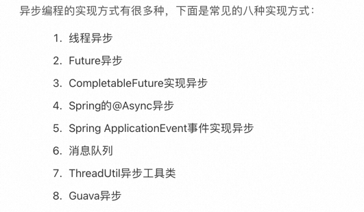
- 线程的六大状态
- 1 创建 new
- 2 运行 runnable
- 3 终止 terminated
- 4 阻塞 block
- 5 等待 wait
- 6 定时等待 timed_waiting

### 7 索引
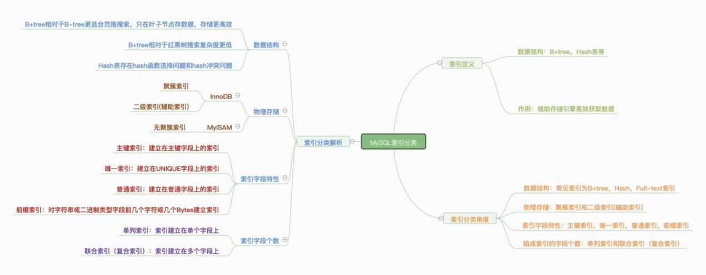
- 索引是用写性能换取读性能的技术
- 索引最好不要超过六个、
- 索引数据类型越简单越好，能用int就不要用string
-  数字索引只比较一次，字符串索引会逐字比较
-  重复数据多的字段不适合建立索引，如性别；随机字符串不适合建立聚族索弘（数据移动）

#### 索引页
但是现在假设有很多很多的是数据页，那是不是对应的主键目录会很大很大呢？

那假设有1000万条记录、5000万条记录呢？是不是就算是二分法查找，其效率也依旧是很低的，所以为了解决这种问题 MySQL 又设计出了一种新的存储结构—索引页。例如有下面这样情况，

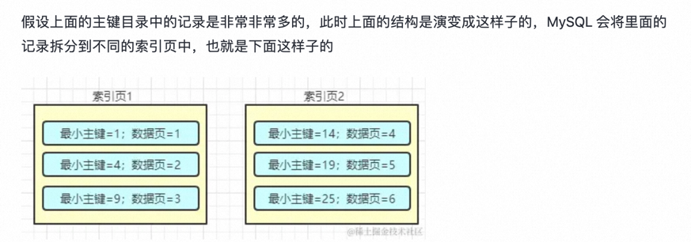

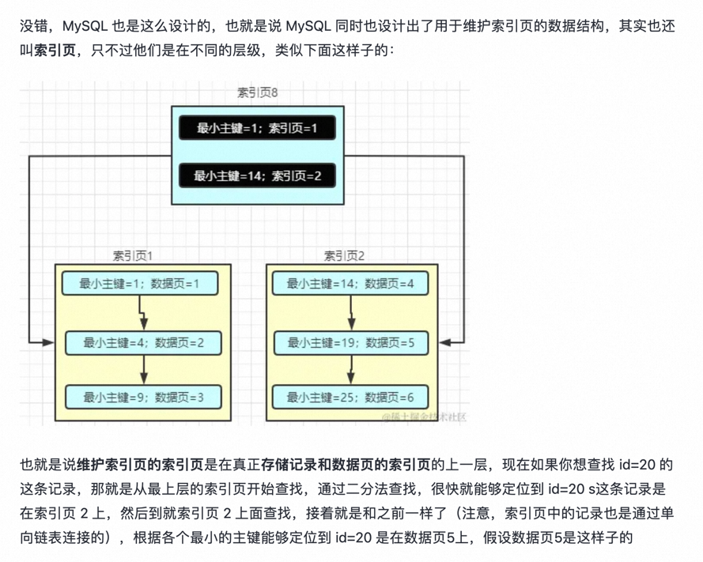

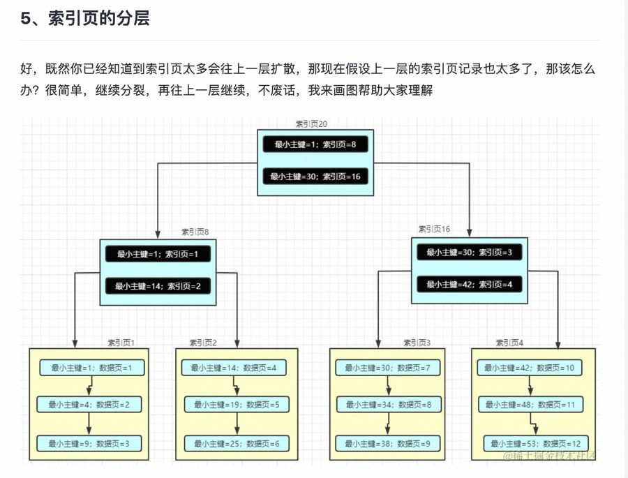

我看明白了，你看明白了吗？我们来模拟一个查找的过程，假设你要查找 37 这条记录，说实话我根本不知道这条记录在哪里。好，现在我们就来模拟 MySQL 的查找过程，首先从最顶层的索引页开始查找，因为 id=37，因此定位到了索引页16，然后到索引页 16 中继续查找，此时同样能够定位到 id=37 在索引页 3 中，然后继续查找，最终能够定位到数据实在数据页 8 中，假设数据页 8 是这样子的

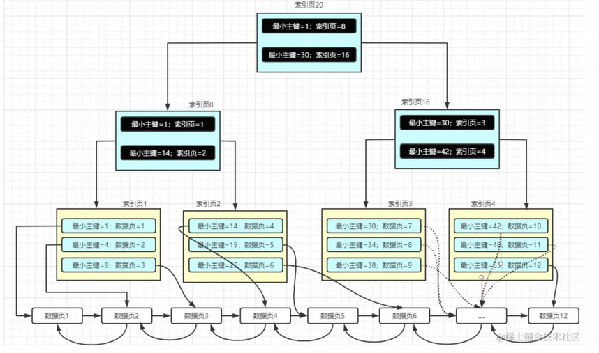

这个时候机智的你是不是已经发现了什么小秘密？他是不是很像一颗二叉树？实际上这就是一颗 B+ 树的结构，这也是数据在磁盘中真正存储的物理结构。B+树的特性是什么呢？B+树，也是二叉搜索树的一种，但是他的数据仅仅存储在叶子节点（在这里就是数据页），像这种索引页+数据页组成的组成的B+树就是聚簇索引(这句话很重要)。

#### 非主键索引
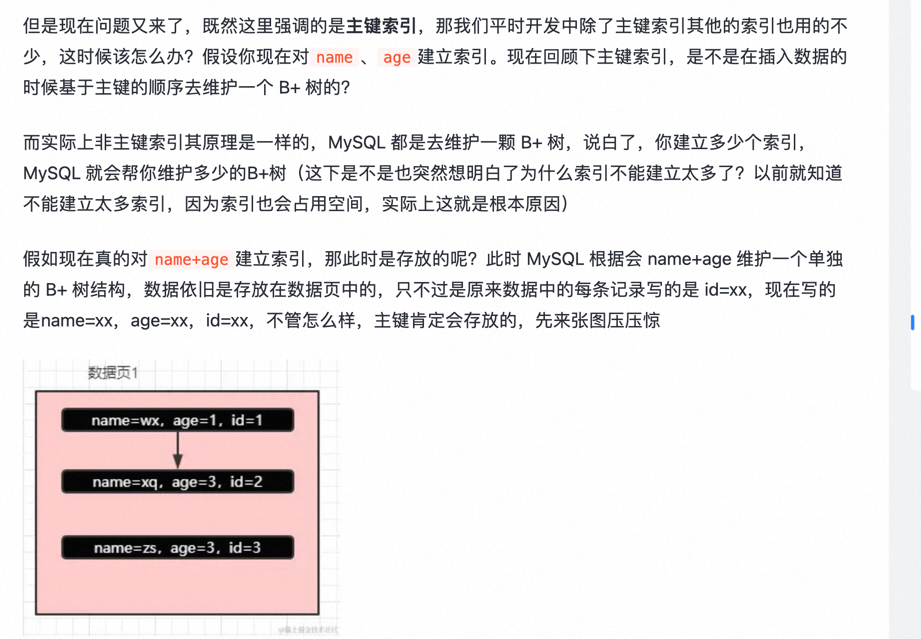
左前缀法则
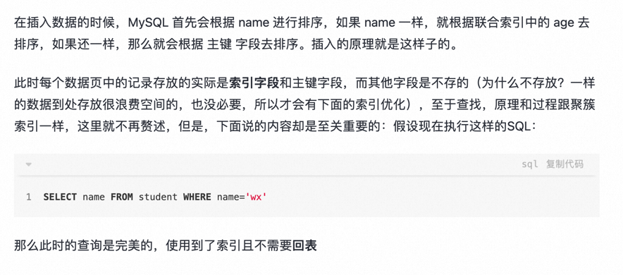

> 回表

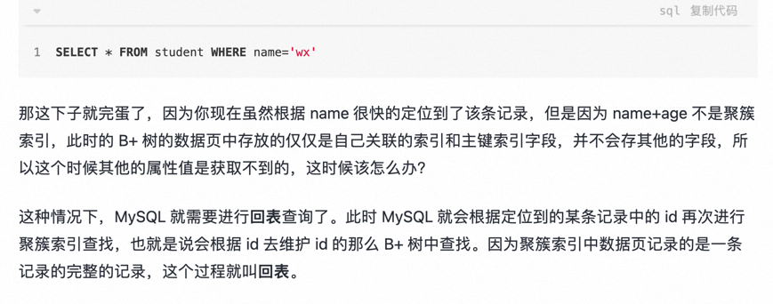
再强调下回表的含义：根据非主键索引查询到的结果并没有查找的字段值，此时就需要再次根据主键从聚簇索引的根节点开始查找，这样再次查找到的记录才是完成的。

对于非主键索引（一般都是联合索引），在维护 B+ 树的时候，会根据联合索引的字段依次去判断，假设联合索引为：name + address + age，那么 MySQL 在维护该索引的 B+ 树的时候，首先会根据 name 进行排序，name 相同的话会根据第二个 address 排序，如果 address 也一样，那么就会根据 age 去排序，如果 age 也一样，那么就会根据主键字段值去排序，且对于非主键索引，MySQL 在维护 B+ 树的时候，仅仅是维护索引字段和主键字段。

> 数据结构
#### hash索引
> Hash 索引结构的特殊性，其检索效率非常高，索引的检索可以一次定位，不像B-Tree 索引需要从根节点到枝节点，最后才能访问到页节点这样多次的IO访问，所以 Hash 索引的查询效率要远高于 B-Tree 索引。虽然 Hash 索引效率高，但是 Hash 索引本身由于其特殊性也带来了很多限制和弊端，主要有以下这些。
- 1 Hash 索引仅仅能满足 = , IN 和 <=>(表示NULL安全的等价) 查询，不能使用范围查询。
  由于 Hash 索引比较的是进行 Hash 运算之后的 Hash值，所以它只能用于等值的过滤，不能用于基于范围的过滤，因为经过相应的 Hash算法处理之后的 Hash 值的大小关系，并不能保证和Hash运算前完全一样。
- 2 Hash 索引无法适用数据的排序操作。
  由于 Hash 索引中存放的是经过 Hash 计算之后的 Hash值，而且Hash值的大小关系并不一定和 Hash运算前的键值完全一样，所以数据库无法利用索引的数据来避免任何排序运算；
- 3 Hash 索引不能利用部分索引键查询。
  对于组合索引，Hash 索引在计算 Hash 值的时候是组合索引键合并后再一起计算 Hash 值，而不是单独计算 Hash值，所以通过组合索引的前面一个或几个索引键进行查询的时候，Hash 索引也无法被利用。
- 4 Hash 索引依然需要回表扫描。
  Hash 索引是将索引键通过 Hash 运算之后，将 Hash运算结果的 Hash值和所对应的行指针信息存放于一个 Hash 表中，由于不同索引键可能存在相同 Hash 值，所以即使取满足某个 Hash 键值的数据的记录条数，也无法从 Hash索引中直接完成查询，还是要通过访问表中的实际数据进行相应的比较，并得到相应的结果。
- 5 Hash索引遇到大量Hash值相等的情况后性能并不一定就会比B-Tree索引高。
  选择性比较低的索引键，如果创建 Hash 索引，那么将会存在大量记录指针信息存于同一个Hash值相关联。这样要定位某一条记录时就会非常麻烦，会浪费多次表数据的访问，而造成整体性能低下

#### B树索引
- 从B树的结构图中可以看到每个节点中不仅包含数据的 key 值，还有 data 值
- 而每页的存储空间是有限的，如果 data 比较大，会导致每个节点的 key 存储的较少，当数据量较大的时候，同样会导致B树很深，从而增加了磁盘 IO 的次数，进而影响查询效率。

#### b+树索引
- 1 在 B+ 树中，所有数据记录节点都是按照键值的大小存放在同一层的叶子节点上，而非叶子结点只存储key的信息，这样可以大大增加每个节点的存储的key的数量，降低B+ 树的高度
- 2 B+ 树叶子节点的关键字从小到大==有序排列==，左边结尾数据都会保存右边节点开始数据的指针。
- 3 B+ 树的层级更少：相较于 B 树 B+ 每个非叶子节点存储的关键字数更多，树的层级更少所以查询数据更快
- 4 B+ 树查询速度更稳定：B+ 所有关键字数据地址都存在叶子节点上，所以每次查找的次数都相同所以查询速度要比B树更稳定;
- 5 B+ 树天然具备排序功能：B+ 树所有的叶子节点数据构成了一个有序链表，在查询大小区间的数据时候更方便，数据紧密性很高，缓存的命中率也会比B树高。
- 6 B+ 树全节点遍历更快：B+ 树遍历整棵树只需要遍历所有的叶子节点即可，，而不需要像 B 树一样需要对每一层进行遍历，这有利于数据库做全表扫描。
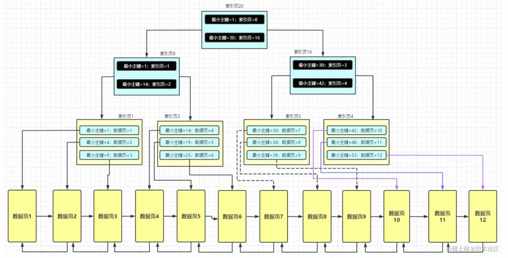

> 存储方式
#### 聚簇索引
- 聚簇索引的每个叶子节点存储了一行完整的表数据，叶子节点间按id列递增连接，可以方便地进行顺序检索。
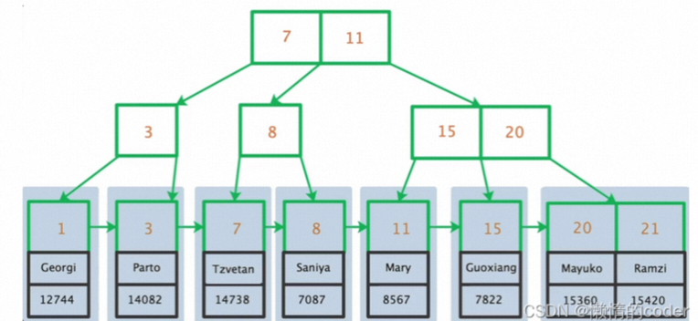
- InnoDB表要求必须有聚簇索引，默认在主键字段上建立聚簇索引 （也就是主键索引），在没有主键字段的情况下，表的第一个非空的唯一索引将被建立为聚簇索引，在前两者都没有的情况下，InnoDB将自动生成一个隐式的自增id列，并在此列上建立聚簇索引。

#### 二级索引
- 二级索引的叶子节点并不存储一行完整的表数据，而是存储了聚簇索引所在列的值。
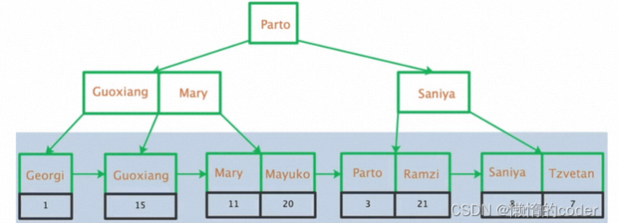

##### 回表查询
由于二级索引的叶子节点不存储完整的表数据，索引当通过二级索引查询到聚簇索引列值后，还需要回到聚簇索引也就是表数据本身进一步获取数据。
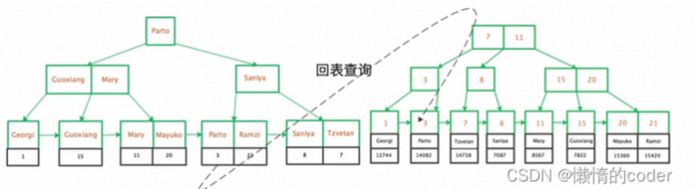
需要注意的是，通过二级索引查询时，回表不是必须的过程，当SELECT的所有字段在单个二级索引中都能够找到时，就不需要回表，MySQL称此时的二级索引为覆盖索引或触发了索引覆盖。

#### 非聚簇索引

- 以MyISAM为存储引擎的表不存在聚簇索引。
- 非聚簇索引都叫二级索引（辅助索引）
- MyISAM表中的主键索引和非主键索引的结构是一样的，索引的叶子节点不存储表数据，存放的是表数据的地址。所以，MyISAM表可以没有主键。
- 以MyISAM为存储引擎的表不存在聚簇索引。
  MyISAM表中的主键索引和非主键索引的结构是一样的，索引的叶子节点不存储表数据，存放的是表数据的地址。所以，MyISAM表可以没有主键。

> 索引字段特性
#### 主键索引
建立在主键上的索引被称为主键索引，一张数据表只能有一个主键索引，索引列值不允许有空值，通常在创建表时一起创建。
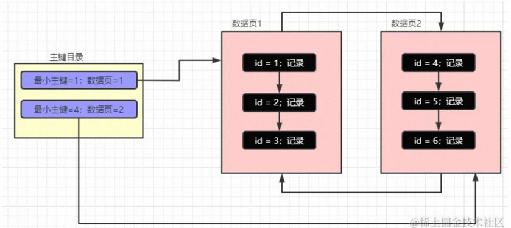
我们都知道 MySQL 在存储数据的时候是以数据页为最小单位的，且数据在数据页中的存储是连续的，数据页中的数据是按照主键排序的（没有主键是由 MySQL自己维护的 ROW_ID 来排序的），数据页和数据页之间是通过双向链表来关联的，数据与数据时间是通过单向链表来关联的。

也就是说有一个在每个数据页中，他必然就有一个最小的主键，然后每个数据页的页号和最小的主键会组成一个主键目录（就像上图中的左边部分），假设现在要查找主键为 2 的数据，通过二分查找法最后确定下主键为 2 的记录在数据页 1 中，此时就会定位到数据页 1 接着再去定位主键为 2 的记录，我们先知道大致的流程，细节先不要深究，先从宏观看结构原理，再到微观看实现原理。

#### 唯一索引
建立在UNIQUE字段上的索引被称为唯一索引，一张表可以有多个唯一索引，索引列值允许为空，列值中出现多个空值不会发生重复冲突。

#### 普通索引
建立在普通字段上的索引被称为普通索引。

#### 前缀索引
前缀索引是指对字符类型字段的前几个字符或对二进制类型字段的前几个bytes建立的索引，而不是在整个字段上建索引。前缀索引可以建立在类型为char、varchar、binary、varbinary的列上，可以大大减少索引占用的存储空间，也能提升索引的查询效率。

> 索引字段个数
#### 联合索引
建立在多个列上的索引被称为联合索引，又叫复合索引、组合索引。
- 遵循左前缀法则，如果不遵循 就会出现索引失效

#### 单列索引
建立在单个列上的索引被称为单列索引。

#### 慢查询
排查
- 是否查询了多余字段
- 夸多表扫描
- 是否建立索引，索引是否可以优化?
- 索引是否失效 
> 索引失效
> 1 避免在where 里使用 or, in , not in, is null
> 2 匹配查询 like %k%
> 3 != \<> 通配符

### 8 TCP三次握手四次挥手
- 1 建立tcp链接 确认算法接受能力是否正常
> 第一次握手: 客户端发送SYN包到服务器，客户端进入syn_send状态，等待服务器确认
> 第二次握手 服务器收到syn包后，回发一个 syn + ack 包给客户端，服务器进入 syn_received状态
> 第三次握手 客户端收到 syn_ack包后，向服务器发送ack包，发送完毕。客户端和服务器进入establish状态

- 2 四次挥手
> 第一次挥手 主动关闭方（1） 向被动关闭方（2）发送一个FIN包
> 第二次挥手 2 收到fin包后向 1 发送 ack包
> 此时还能继续进行数据传输
> 第三挥手 2 又向1 发送一个 fin 包 用来关闭 2 到 1 的数据传输
> 第四次挥手 1 收到fin 包后，1 向 2 发送一个ack 包 

### 9 用户态和内核态
内核态：处于内核态的 CPU 可以访问任意的数据，包括外围设备，比如网卡、硬盘等，处于内核态的 CPU 可以从一个程序切换到另外一个程序，并且占用 CPU 不会发生抢占情况，一般处于特权级 0 的状态我们称之为内核态。
用户态：处于用户态的 CPU 只能访问受限资源，不能直接访问内存等硬件设备，不能直接访问内存等硬件设备，必须通过「系统调用」陷入到内核中，才能访问这些特权资源。
> 为什么要区分用户态和内核态
在 CPU 的所有指令中，有一些指令是非常危险的，如果错用，将导致整个系统崩溃，比如：清空内存，修改时钟等。如果所有的程序代码都能够直接使用这些指令，那么很有可能我们的系统一天将会死 n 次。

所以，CPU将指令分为 特权指令 和 非特权指令 ，对于较为危险的指令，只允许操作系统本身及其相关模块进行调用，普通的、用户自行编写的应用程序只能使用那些不会造成危险的指令。
基于安全的考虑，CPU 提供了特权分级机制，把区域分成了四个 Ring，越往里权限越高，越往外权限越低。
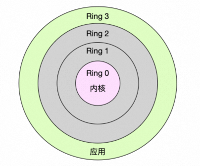

> 什么时候会从用户态陷入内核态？

有三种方式程序会从用户态陷入内核态：
- 系统调用：这是用户态进程主动要求切换到内核态的一种方式，用户态进程通过系统调用申请使用操作系统提供的服务程序完成工作。
- 异常：当CPU在执行运行在用户态下的程序时，发生了某些事先不可知的异常，这时会触发由当前运行进程切换到处理此异常的内核相关程序中，也就转到了内核态，比如缺页异常。
- 外围设备的中断：当外围设备完成用户请求的操作后，会向CPU发出相应的中断信号，这时CPU会暂停执行下一条即将要执行的指令转而去执行与中断信号对应的处理程序，如果先前执行的指令是用户态下的程序，那么这个转换的过程自然也就发生了由用户态到内核态的切换。比如硬盘读写操作完成，系统会切换到硬盘读写的中断处理程序中执行后续操作等。

> 什么是系统调用？过程是怎么样的？

当程序需要访问硬件资源的时候，比如内存、硬盘等，就需要通过「系统调用」陷入到内核中，才能访问这些特权资源。系统调用可以理解为内核实现的函数，比如应用程序要通过网卡接收数据，会调用 Socket 的 read 函数。
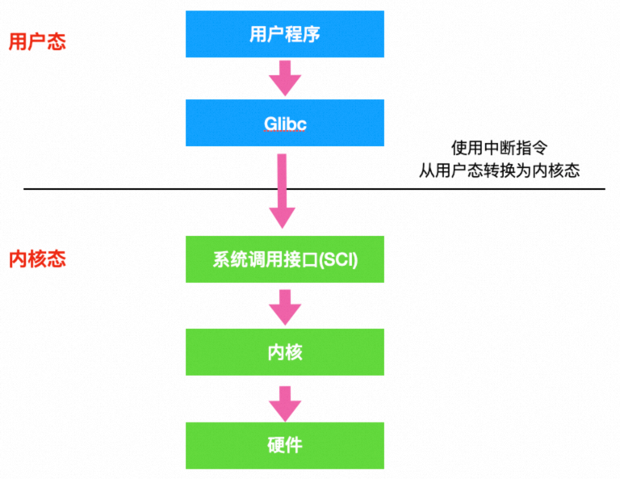
程序在执行系统调用的过程中会从用户态切换到内核态，再从内核态切换到用户态，过程如下：
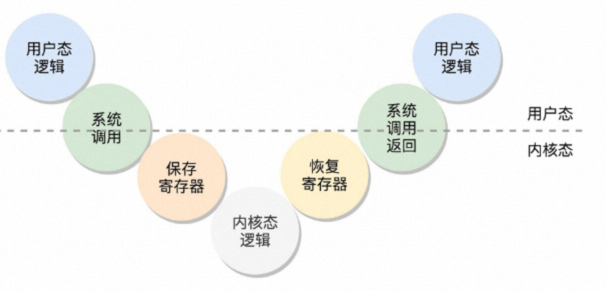

> 系统调用流程

- 从用户态到内核态：当应用程序使用系统调用时，先将系统调用名称转换为系统调用号，接着将「系统调用号」和「请求参数」放到寄存器里，然后执行中断指令（int $0x80 指令），产生一个中断，CPU 陷入到内核态。
- 执行内核态逻辑：CPU 跳转到中断处理程序，先将当前用户态的寄存器（用户态的代码段、数据段、保存参数的寄存器）保存到内核数据结构，接着将系统调用号从寄存器里面取出来，最后根据系统调用号，在「系统调用表」中找到相应的系统调用函数进行调用，并将寄存器中保存的参数取出来，作为函数参数。
- 从内核态到用户态：执行完系统调用后，执行中断返回指令（iret 指令），将原来用户态保存的现场恢复回来，包含代码段、指令指针寄存器等。这时候 CPU 恢复到用户态，用户态进程恢复执行。

一次系统调用过程中的，会发生两次「 CPU 上下文切换」（所谓的 CPU 上下文就是 CPU 寄存器和程序计数器）：
- 第一次 CPU 上下文切换是从用户态切换到内核态：CPU 寄存器里原来用户态的指令位置，需要先保存起来。接着，为了执行内核态代码，CPU 寄存器需要更新为内核态指令的新位置。最后才是跳转到内核态运行内核任务。
- 第二次 CPU 上下文切换是从内核态切换到用户态： CPU 寄存器需要恢复原来保存的用户态，然后再切换到用户空间，继续运行进程。

> 用户态和内核态是如何切换的？

Linux 系统中每个进程都有两个栈，分别是用户栈和内核栈，当应用程序运行在用户态的时候，就会使用用户栈，当应用程序运行在内核态的时候，就会使用内核栈。

内核态与用户态的相互切换，其中最重要的一个步骤就是用户栈和内核栈的切换。

- 1 从用户栈到内核栈
  执行中断指令（int $0x80 指令），中断发生时，CPU 去一个特定的结构（比如 TSS）中，获取该进程的内核栈的地址信息，也就是内核栈的段选择子和栈顶指针（这两个东西是描述内核栈在内存的哪个地址空间），并分别送入 ss 寄存器和 rsp 寄存器，这时候 CPU 就指向了该进程的内核栈的栈顶位置了，这就完成了用户态到内核态的一次栈的切换。
- 然后，IP 寄存器（指令指针寄存器）跳入中断服务程序开始执行，中断服务程序会把用户态的所有寄存器压入到内核栈中，如下图，CPU 自动地将用户态栈的段选择子 ss3，和栈顶指针 rsp3 都放到内核态栈里了。这里的数字 3 代表了 CPU 特权级，内核态是 0，用户态是 3。

- 2 内核栈到用户栈
- 当中断结束时，中断服务程序会从内核栈里将 CPU 寄存器的值全部恢复，最后再执行iret指令。
  将 ss3/rsp3 都弹出栈，并且将这个值分别送到 ss 和 rsp 寄存器中，这时候 CPU 就指向了该进程的用户栈的栈顶位置了，这样就完成了从内核栈到用户栈的一次切换。
  内核栈的 ss0 和 rsp0 也会被保存到前面所说的 CPU 的一个特定的结构（比如 TSS）中，以供下次切换时使用。

### 10 xcPlus
云上课堂是基于Spring cloud alibaba技术栈开发的前后端分离的微服务项目，该项目旨在提供一个商家入驻卖课，学生线上学习的中介平台。
使用的技术栈有，mysql与mybatis plus 的持久层解决方案，Redis缓存，Redisson分布式锁，elasticsearch搜索引擎，minion分布式文件系统，xll任务调度，rabbitmq消息列表
下面重点介绍三个本人开发的模块
- 先简单说一下云上课堂微服务的模块设计
- 首先有一个parent工程，该模块仅有一个pom文件，同一个管理整个项目的公共以来
- 其他的具体模块（比如内容管理模块）都会继承parent工程
- 具体模块又下有三个子模块，api模块，model模块，service模块
- ，model为数据模型工程，管理po和dto，service为业务工程，api为接口工程，service依赖model，api依赖service
#### 1 内容管理模块
- 该模块统一管理商家的课程发布，这里详细讲解一下，课程发布功能
- 课程发布时需要同时向数据库插入课程发布信息，Redis写入缓存信息，elasticsearch写入索引，MINIO写入静态化页面
- 课程预览页面静态化目的是在极短的时间内将课程信息展示给用户，而不用去数据查询。
- 那么这里就涉及到分布式事务的问题, 本项目采用 在数据库新增 消息表 + 任务调度来解决分布式事务问题
- 采用本地事务绑定 课程发布表 和 消息表 ，保证课程插入课程发布表，必然向消息表插入一条任务，通过xxljob定时扫描消息表执行任务，依次向 redis,elasticsearch，minio同步数据。
- 同步完成后，删除消息表的数据
- 整体为AP 最终一致性

#### 2 媒资管理模块
> 视频分为 编解码器（codec） 与 容器（container） 两个部分
> 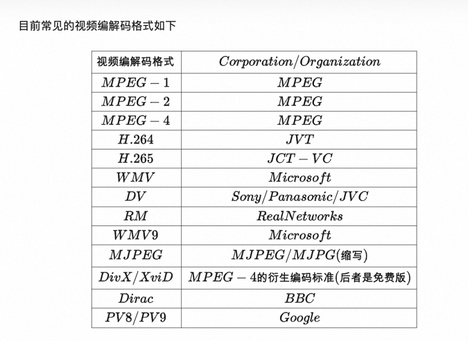
> 
- 该模块为统一管理媒体文件，这里详细说明一下 视频封装格式转化功能
- 视频封装格式功能旨在将输入任意视频格式，均转化为mp4后缀，方便媒资模块后续的课程在线预览功能。
- 解决方案为数据库新增一个media_process的表，数据库每插入一个视频记录，就会在该表插入对于的任务。
- 通过xxl-job(多线程)定时扫描media_process表，开始从minio下载视频文件，通过FFmpeg对视频进行格式转化，将新的视频重新上传到minio，更新url

#### 3 认证授权模块
- 认证授权模块旨在提供用户身份认证和用户授权功能。这里详细说明一下，基于gateway实现单点登录功能(SSO)。
- gateway的职责 ：1 白名单维护 2 校验jwt
- 1 创建一个AuthParamsDto 来接收统一的认证信息
- 2 重写UserDetailsService 的 loadUserByUsername(), 获得自定义的UserDetails

### 11 xxl-job
- 可以简单分为两部分，调度中心和执行器
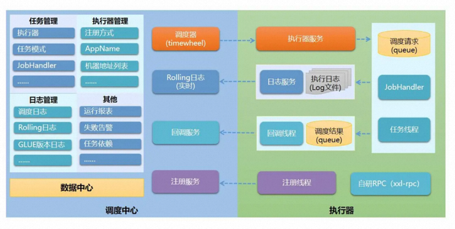
- 调度中心HA(中心式)：调度中心采用中心式设计，调度中心自研调度组件并支持集群部署，保证HA
- 执行器HA(分布式)：任务分布式执行，任务执行器支持集群部署，可保证执行器的HA
- 注册中心：执行器会周期的自动注册任务，调度中心将会自动发现注册的任务并出发执行。

> 架构

> 调度中心：负责管理调度信息，按照调度配置发出调度请求，自身不承担业务代码， 
> @XxlJob("firstTask")
> 调度系统与任务解耦，提高了系统可用性与稳定性，同时调度系统性能不在受限于任务模板。
> 支持可视化，简单且动态的管理调度信息，包括任务增删改查和报警等

> 执行器：
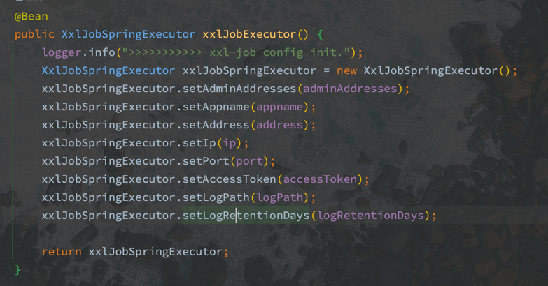
> 负责接收调度请求并执行任务逻辑。执行器专注于任务的执行等操作，开发和维护更加简单和高效，接收”调度中心“的执行，终止和日志请求。
> 

### 12 Spring security
- Spring Security 所解決的问题就是安全访问控制，而安全访问控制功能其实就是对所有进入系统的请求进行拦截，校验每个请求是否能够访问它所期望的资源。
- 根据前边知识的学习，可以 通过 Filter 或 AOP 等技术来实现，Spring Security 对 Web 资源的保护是靠 Filter 实现的，所以从这个Filter 来入手，逐步深人 Spring Security 原理。

- 当初始化 Spring Security 时，会创建一个名为 SpringsecurityFilterChain 的 Servlet 过滤器，
- 类型为 org.springframework.security web.Filter ChainProxy，
- 它实现了 javax.servlet.Filter，因此外部的请求会经过此类，下图是 Spring Security 过虑器链结构图：
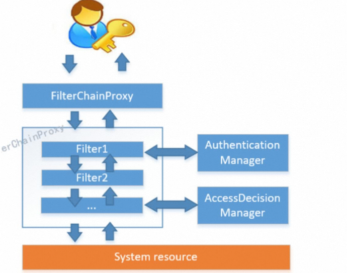

- FilterChainProxy 是一个代理，真正起作用的是FilterChainProxy 中 Security FilterChain 所包 含的各个Filter， 
- 同时这些 Filter 作为 Bean 被Spring 管理，它们是 Spring Security 核心，各有各的职责，
- 但他们并不直接处理用户的认证，也不直接处理用户的授权，
- 而是把它们交给了认证管理器 (AuthenticationManager）和决策管理器 (AccessDecisionManager）进行处理

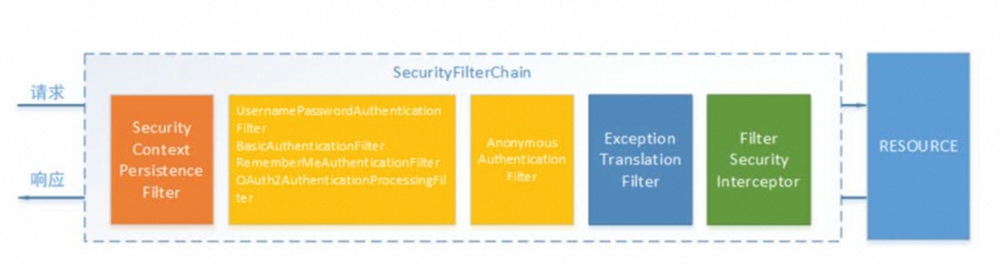

#### SecurityContextPersistenceFilter
- SecurityContextPersistence Filter 这个Filter 是整个拦截过程的入口和出口（也就是第一个和最后一个拦截器），
- 会在请求开始时从配置好的 SecurityContextRepository 中获取 SecurityContext，然后把它设置给 SecurityContextHolder。 
- 在请求完成后将 SecurityContextHolder 持有的 SecurityContext 再保存到配置好的 SecurityContextRepository 
- 同时清除 securityContextHolder 所持有的 SecurityContext;

#### Username PasswordAuthenticationFilter
- UsernamePasswordAuthenticationFiter 用于处理来自表单提交的认证。
- 该表单必须提供对应的用户名和密码，其内部还有登录成功或失败后进行处理的 
- AuthenticationSuccessHandler 和 AuthenticationFailureHandler，这些都可以棍据需求做相 关改变；

#### FilterSecuritylnterceptor
FilterSecurityinterceptor 是用于保护web 资源的，使用 AccessDecisionManager 对当前用 广进行授权访问，前面已经详细介绍过了；

#### ExceptionTranslationFilter
- ExceptionTranslationFilter 能够多捕获来自FilterChain 所有的异常，并进行处理。
- 但是它只会处理两类异常：AuthenticationException 和 AccessDenied Exception，
- 其它的异常它会继续抛出。

#### Spring security 执行流程
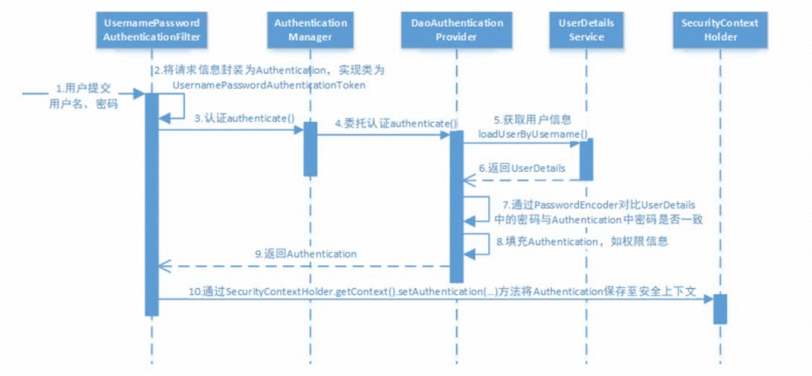
- 1 用户名和密码被SecurityFilterChain 中的 UsernamePasswordAuthenticationFilter封装为Authentication, 通过UsernamePasswordAuthenticationToken
- 2 UsernamePasswordAuthenticationFilter将Authentication提交到 认证管理器 (AuthenticationManager) 进行认证
- 3 AuthenticationManager 将 Authentication 提交到 DaoAuthenticationProvider 委托认证
- 4 DaoAuthenticationProvider 调用 UserDetailService.loadUserByUsername() 获取 UserDetails
- 5 通过PasswordEncoder 对比 UserDetails 与 Authentication 中的用户密码
- 6 填充Authentication 中的一些信息，比如权限，并放回给UsernamePasswordAuthenticationFilter
- 7 通过securityContextHolder 将Authentication 设置到上下文
> 可以看出 AuthenticationManager接口（认证管理器）是认证相关的校心接口，
也是发起认证的出发点，它的实现类为 ProviderManager。 而 Spring Security 支持多种认证
方式，因此ProviderManager维护着一个 List<AuthenticationProvider>列表，存放多种
认证方式，最终实际的认证工作是由 AuthenticationProvider完成的。咱们知道 web 表单的对
应的 AuthenticationProvider 实现类为 DaoAuthenticationProvider，它的内部又维护着一个
UserDetailsService 负责 UserDetaiis 的获取。最终 AuthenticationProvider将 UserDetails 填
充至 Authenticationo

oauth2

JWT
- 可以实现无状态认证
- 1 jwt 基于 json，非常方便解析。
- 2 可以在合牌中自定义丰富的内容， 易扩展。
- 3 通过非对称加密算法及数宇签名技术，JWT防止篡改，安全性高。
- 4 资源服务使用JWT 可不依赖认证服务即可完成授权。
- 缺点
- JWT 令牌较长，占存储空间比较大。
> JWT 合牌由三部分组成，每部分中问使用点 （）分隔，比如：xxxxx yyyyy.22222
> 1 header
> 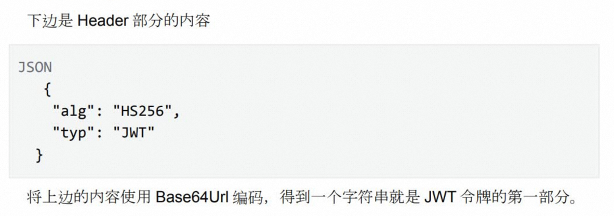
> 2 payload
> 第二部分是负载，内容也是一个json对象，它是存放有效信息的地方，它可以存放jut提供
的信息宇段，比如：iss(签发者）,exp（过期时问戳） ,sub(面向的用户）等，也可自定义
宇段。 此部分不建议存放敏感信息，因为此部分 可以解码还原原始内容。 最后将第二部分负载使用 Base64Url编码，得到一个宇符串就是JWT 合牌的第二部分。
> 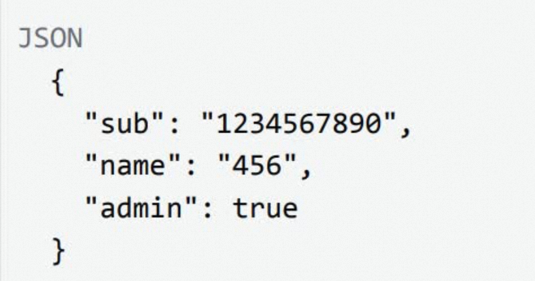
> 
> 3 Signature
> 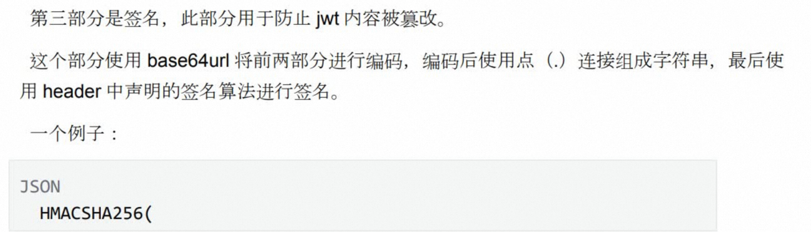